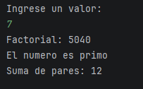

UT0 - Ejercicio 4: Factorial, primalidad y sumas condicionales
-

**Punto 1:** Contemplar y documentar casos borde: 0, 1, negativos y valores demasiado grandes para el tipo elegido.

El método factorial contempla si el número es negativo, se muestra un mensaje indicando que el factorial no existe.

**Punto 2:** Implementar un programa que determine si un número es primo. 

Se utiliza el método isPrime en el cual primero se verifica que no sea ni 0 ni 1 ya que se sabe que no son primos. Si este caso sucede devuelve un valor _false_

**Punto 3:** Si el número es primo, calcular la suma de los pares entre 0 y ese valor; si no lo es, calcular la suma de los impares. 

**Punto 4:** Separar la solución en métodos bien nombrados y reutilizables. 

* factorial(int num)
* isPrime(long n)
* sumaPares(int n)
* sumaImpares(int n)

**Punto 5:** Juego mínimo de pruebas manuales con entradas y salidas esperadas. 

1. Primero se solicita al usuario que ingrese un valor
2. Llama al método UtilMath.factorial(7). El método lo que hace es 1 x 2 x 3 x 4 x 5 x 6 x 7. Esto da como resultado 5040
3. Verifica si el número es primo. Llama a UtilMath.isPrime(7), el método revisa si 7 tiene divisores entre 2 y 6, como no tiene es primo.
4. Al saber que es primo entra al if, llama al método UtilMath.sumaPares(7) y suma los pares entre 0 y 7. Dando como resultado 12.

Explicación de al menos dos decisiones de diseño.
